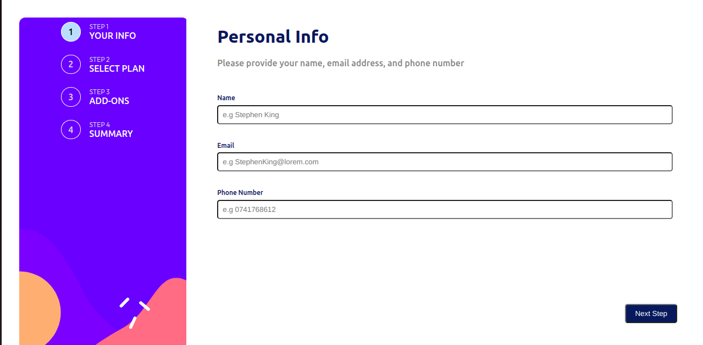

# Frontend Mentor - Multi-step form solution

This is a solution to the [Multi-step form challenge on Frontend Mentor](https://www.frontendmentor.io/challenges/multistep-form-YVAnSdqQBJ). Frontend Mentor challenges help you improve your coding skills by building realistic projects.

## Table of contents

- [Overview](#overview)
  - [The challenge](#the-challenge)
  - [Screenshot](#screenshot)
  - [Links](#links)
- [My process](#my-process)
  - [Built with](#built-with)
  - [What I learned](#what-i-learned)
  - [Continued development](#continued-development)
- [Author](#author)

## Overview

### The challenge

Users should be able to:

- Complete each step of the sequence
- See a summary of their selections on the final step and confirm their order
- View the optimal layout for the interface depending on their device's screen size
- See hover and focus states for all interactive elements on the page

### Screenshot

### Links

- Solution URL: [Solution-url](https://github.com/kabszac/multi-step-form)
- Live Site URL: [live site URL ](https://kabszac.github.io/multi-step-form/)

## My process

### Built with

- Semantic HTML5 markup
- CSS custom properties
- Flexbox
- Mobile-first workflow
- [React](https://reactjs.org/) - JS library
- React-formik
- Yup

### What I learned

I learnt how to use React formik to create a responsive multi-step-form and handle validation with yup.

### Continued development

Building functional and responsive websites

## Author

- Website - [Isaac Kuria](https://kabszac.github.io/)
- Frontend Mentor - [@kabszac](https://www.frontendmentor.io/profile/kabszac)
- Twitter - [@kabuchoisaac](https://www.twitter.com/kabuchoisaac)
